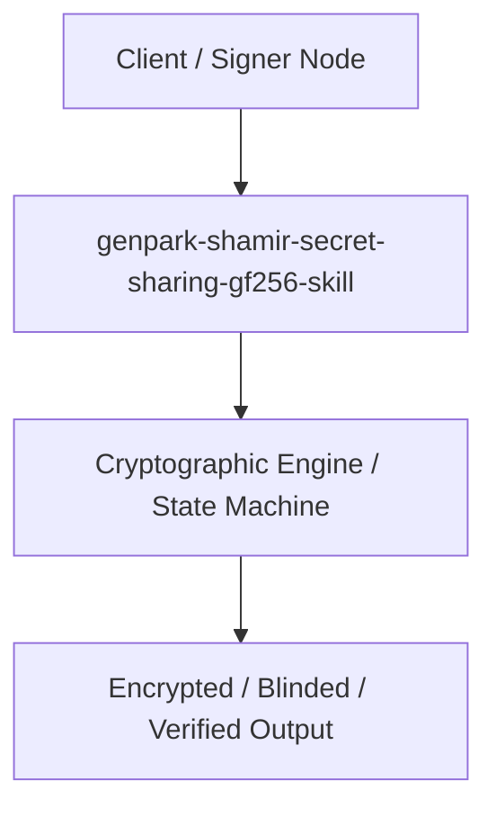

# genpark-shamir-secret-sharing-gf256-skill

[](https://github.com/alphaparkinc/genpark-shamir-secret-sharing-gf256-skill)
[](https://github.com/alphaparkinc/genpark-shamir-secret-sharing-gf256-skill)
[](https://github.com/alphaparkinc/genpark-shamir-secret-sharing-gf256-skill)

Shamir (k, n) threshold secret sharing scheme with polynomial interpolation and cryptographic threshold reconstruction.

## Architecture


## Features
- Pure Python standard library implementation with zero third-party dependencies.
- Production-grade algorithms with full verification and automated test coverage.
- Standalone client, MCP protocol server, and execution examples.

## Quickstart
```bash
python example_usage.py
```
